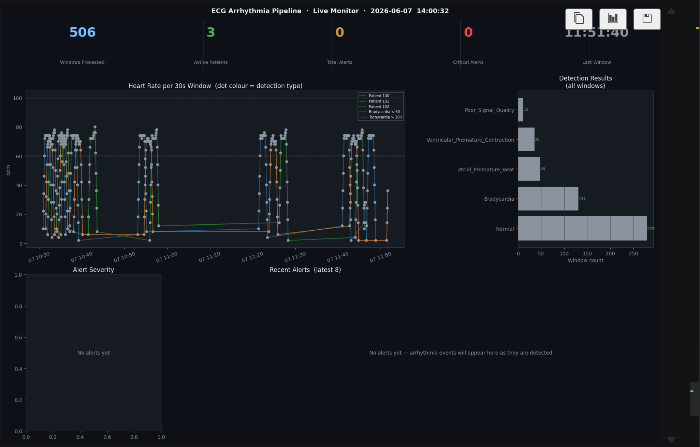

# Real-Time ECG Arrhythmia Streaming Pipeline

Production-pattern real-time data pipeline that simulates a wearable ECG device
streaming cardiac data to Kafka, processes it with Spark Structured Streaming,
detects arrhythmias using clinical decision rules, and stores results in Delta Lake
and PostgreSQL — with daily batch reporting via Airflow.

---

## The Clinical Problem

In remote patient monitoring, ECG data from wearable devices must be processed
in real-time to flag arrhythmias before they become emergencies. This pipeline
simulates that infrastructure — from device data ingestion through real-time
anomaly detection to clinical alerting — using real annotated data from the
MIT-BIH Arrhythmia Database.

---

## Architecture

```
MIT-BIH Arrhythmia Database (PhysioNet)
              │
              ▼
  producer/ecg_producer.py          ← simulates wearable device
  (Python — runs locally)
              │ JSON messages @ 360Hz
              ▼
    Kafka topic: ecg_stream
    (Docker — confluentinc/cp-kafka:7.4.0)
              │
              ▼
  consumer/ecg_stream_processor.py  ← Spark Structured Streaming
  (PySpark local mode)              ← sliding window 30s / 5s slide
              │                     ← rule-based arrhythmia detection (Spark SQL)
    ┌─────────┴──────────┐
    ▼                    ▼
Delta Lake           PostgreSQL
data/delta_lake/     ecg_alerts table
(all windows)        (alerts only)
                         │
                         ▼
              dags/ecg_daily_report.py
              (Airflow DAG — daily 06:00 UTC)
                         │
                         ▼
              ecg_daily_summary table
```

---

## Dataset

**MIT-BIH Arrhythmia Database** — PhysioNet  
https://physionet.org/content/mitdb/1.0.0/  
48 half-hour ECG recordings, 360 Hz sampling, two channels (MLII + V5/V1),  
expert beat-level annotations (15 arrhythmia types).

---

## Live Monitor Dashboard

The pipeline ships with a Jupyter notebook (`notebooks/live_monitor.ipynb`) that reads
directly from Delta Lake and PostgreSQL and auto-refreshes every 10 seconds.



> 3 patients streaming simultaneously — heart rate timeline per 30-second window,
> detection type breakdown (Normal / Bradycardia / Atrial Premature Beat /
> Ventricular Premature Contraction), and real-time alert severity table.

---

## Tech Stack

| Layer | Tool |
|---|---|
| Message broker | Apache Kafka 7.4 + ZooKeeper (Docker) |
| Stream processing | PySpark Structured Streaming 3.5.3 (local mode) |
| Data lake | Delta Lake 3.2.1 (local folder) |
| Alerts storage | PostgreSQL 13 (Docker) |
| Batch orchestration | Apache Airflow 2.9 |
| Signal library | wfdb 4.x (official PhysioNet Python client) |
| Containerisation | Docker Compose |
| Live monitoring | Jupyter + delta-rs (reads Delta Lake without Spark) |

---

## Detection Rules

Rule-based, explainable, and EU MDR 2017/745 compliant — all thresholds
documented with clinical references.

| Rule | Threshold | Severity |
|---|---|---|
| Ventricular ectopic (V/E/F annotation) | MIT-BIH ground truth | High |
| Atrial ectopic (A/a/J/S annotation) | MIT-BIH ground truth | Medium |
| Severe bradycardia | HR < 40 bpm | Critical |
| Bradycardia | HR < 60 bpm | Medium |
| Severe tachycardia | HR > 150 bpm | Critical |
| Tachycardia | HR > 100 bpm | Medium |
| Possible AFib | RR variability > 100ms | High |
| Possible AFib (mild) | RR variability > 50ms | Medium |

---

## Setup

### Prerequisites

- Docker Desktop (running)
- Python 3.9–3.13 (Python 3.14 is **not** supported — py4j IPC incompatibility)
- **Java 21 LTS** — required by Spark 3.5.x on Windows
  - `winget install Microsoft.OpenJDK.21`
  - Java 24 is **not** supported (JEP 486 removed Security Manager used by Hadoop)
- `winutils.exe` + `hadoop.dll` for Hadoop native IO on Windows
  - Download from the `cdarlint/winutils` GitHub repo (`hadoop-3.3.5/bin/`)
  - Place both files in `C:\hadoop\bin\`

### Windows setup (one-time)

```powershell
# Install Java 21 LTS
winget install Microsoft.OpenJDK.21

# Create Hadoop WinUtils directory
New-Item -ItemType Directory -Force C:\hadoop\bin
# Download winutils.exe and hadoop.dll from cdarlint/winutils (hadoop-3.3.5/bin/)
# into C:\hadoop\bin\
```

The consumer script sets `JAVA_HOME`, `HADOOP_HOME`, and `PYSPARK_PYTHON` automatically
at startup — no manual environment variables needed beyond the `winutils.exe` placement.

### Installation

```cmd
git clone https://github.com/PasBless1/ecg-streaming-pipeline.git
cd ecg-streaming-pipeline

python -m venv venv
venv\Scripts\activate

pip install -r requirements.txt
```

### Configure credentials

```cmd
copy .env.example .env
```

Edit `.env` with your passwords.

---

## Running the Pipeline

### Step 1 — Download MIT-BIH data

```cmd
python scripts/download_mitdb.py
```

### Step 2 — Explore the data (optional but recommended)

```cmd
jupyter notebook notebooks/signal_exploration.ipynb
```

### Step 3 — Start Docker services (Kafka + PostgreSQL)

```cmd
docker-compose up -d
```

Wait ~30 seconds for Kafka to be ready.

### Step 4 — Start Spark stream processor

```cmd
python consumer/ecg_stream_processor.py
```

First run downloads Spark JAR packages (~200MB). Wait for:
`Streaming queries active. Waiting for data...`

### Step 5 — Start ECG producer (new terminal)

```cmd
venv\Scripts\activate
python producer/ecg_producer.py --records 100 101 102
```

### Step 6 — Verify alerts in PostgreSQL

```cmd
docker-compose exec postgres psql -U ecg_user -d ecg_pipeline -c "SELECT * FROM ecg_alerts LIMIT 10;"
```

### Step 7 — Query Delta Lake

```python
from pyspark.sql import SparkSession
spark = SparkSession.builder.appName("query").master("local").getOrCreate()
df = spark.read.format("delta").load("data/delta_lake/processed_signals")
df.show(10)
```

---

## Key Engineering Patterns

**Sliding window arrhythmia detection** — 30-second windows sliding every 5 seconds.
Overlapping windows ensure arrhythmic episodes spanning window boundaries are captured
(e.g. a 15-second ventricular tachycardia run would be missed by tumbling windows).

**Watermarking for late data** — 15-second watermark handles network latency in
real wearable scenarios where packets may arrive out of order.

**Back-pressure control** — `maxOffsetsPerTrigger=50000` prevents Spark from being
overwhelmed if the producer runs faster than the consumer can process.

**Annotation-based ground truth** — MIT-BIH expert annotations are propagated
through the Kafka messages, enabling annotation-based rules (highest confidence)
to fire before rate-based rules in the detection hierarchy.

**Lambda architecture** — real-time speed layer (Kafka + Spark) plus batch layer
(Airflow daily report) in one coherent system.

---

## DSGVO / Clinical Privacy Note

This project uses publicly available, de-identified MIT-BIH data under the
ODC-By licence. No real patient data is processed.

In a production EU/German context, equivalent wearable ECG data would be
subject to: DSGVO (EU GDPR), §203 StGB (medical confidentiality), MDR 2017/745
(medical device software classification), and BSI IT-Grundschutz for clinical
IT systems. The rule-based detection design was chosen explicitly for MDR
explainability compliance.

---

## Author

**Blessing Asare**  
MSc Digital Health — Technische Hochschule Deggendorf  
BSc Biomedical Engineering — University of Ghana  
GitHub: [PasBless1](https://github.com/PasBless1)
